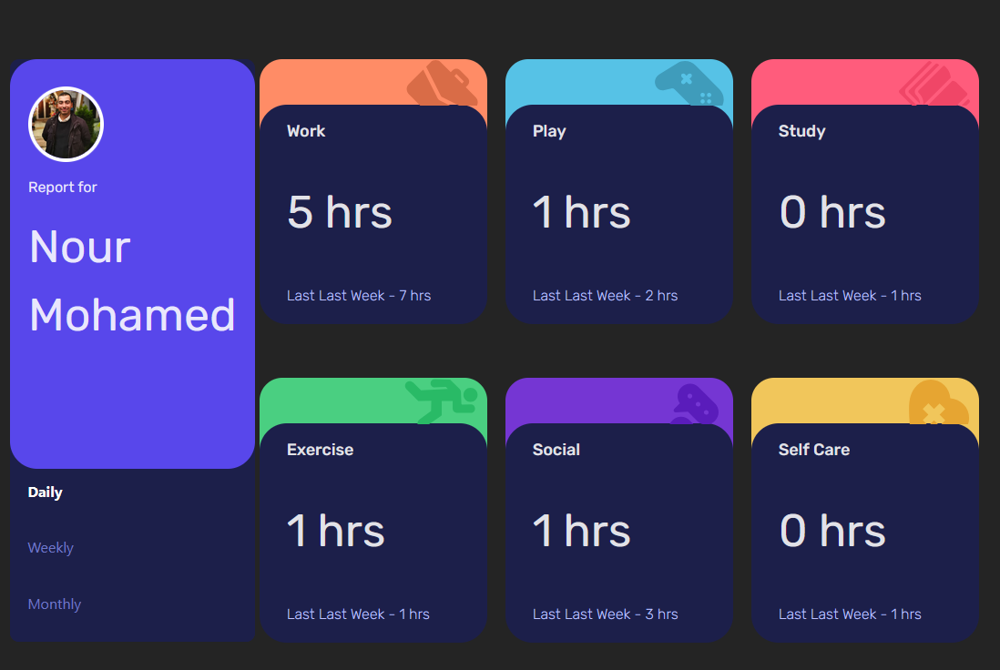

# Time Tracking Dashboard ⏱️

A **time tracking dashboard** built with **React.js**, designed to help users monitor and visualize their daily, weekly, and monthly activities. The app provides a clean and responsive UI for better productivity insights.

## ✨ Features

- View time spent across multiple categories (Work, Play, Study, Exercise, Social, Self-Care).
- Toggle between **daily**, **weekly**, and **monthly** views.
- Responsive design with a modern dashboard layout.
- Data-driven components for easy customization.

## 🛠️ Tech Stack

- **React.js** – Component-based UI
- **CSS** – Styling

- **JSON** – For activity data

## 📖 Usage

- Select between daily, weekly, or monthly to switch timeframes.
- Activities automatically update based on the selected period.
- Customize `data.json` to track your own categories.

## 📸 Screenshots

